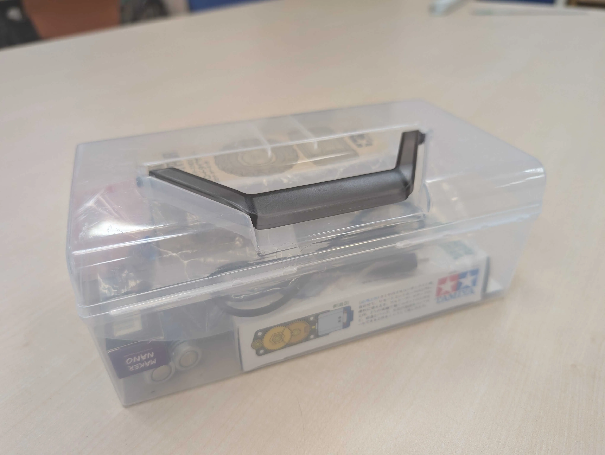

今年度も始まりました遊行塾！今年は17名の生徒が参加してくださることになりました！参加してくださった生徒の方々ありがとうございました。

今回は初回ということで作業工程と配布した部品の確認、ギアボックスの組み立てまで実施しました。生徒たちが真剣に説明を聞いてくれたので進行がスムーズに行えました。\
また、ギアボックスの組み立てはギアの組む順番や向きなど間違えやすい点が多かったですが、サポーターと一緒に協力して授業終了までに参加者全員が組み立て終えることができました！

講師側としては、1年生にとって初めての遊行塾でしたが積極的に生徒に声をかけられていたり、わからない点については先輩に助けを求めて、指示を仰いで主体的に授業に参加できました！。教師役とサポート役も連携することがけることができていました。生徒の進捗を把握して授業を進めることができ生徒を取り残すことなく進行できたと思います。次回からは、はんだ付けに入ります！取り付けの向きやケガなどに注意して作業していきましょう！
