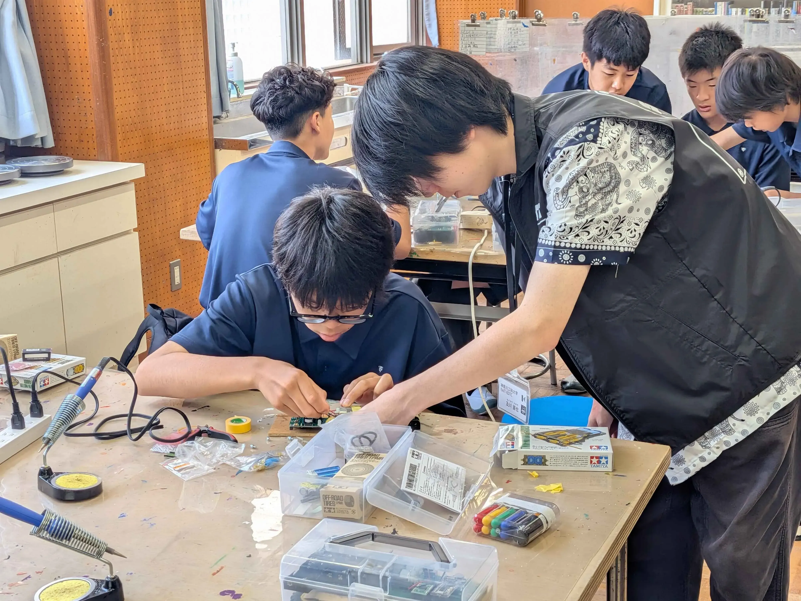
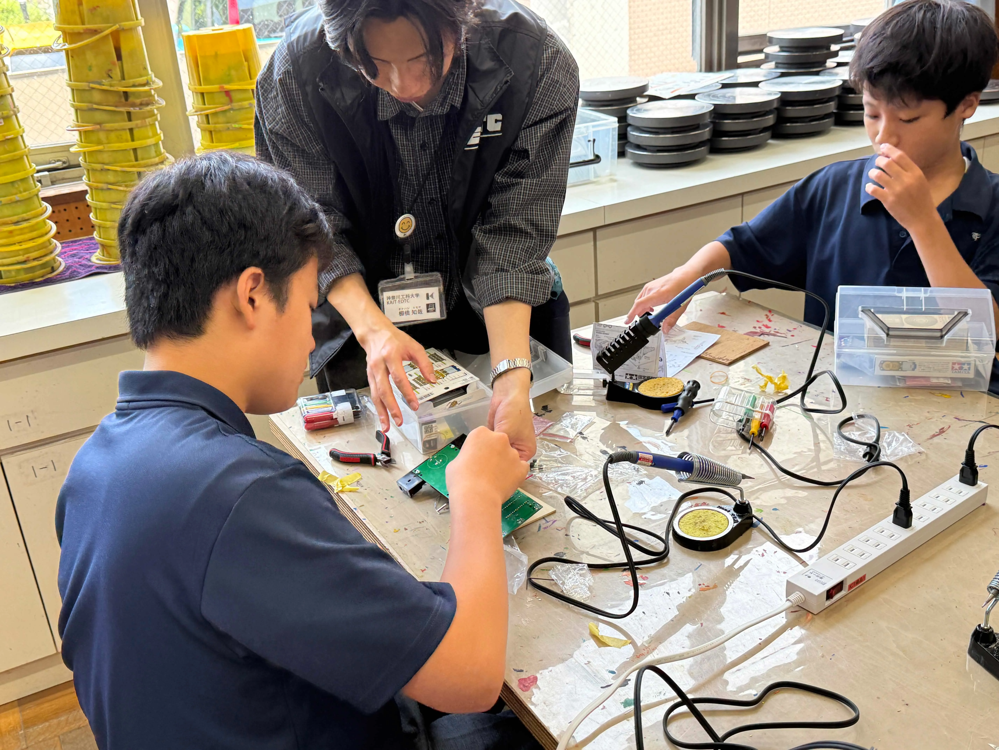

第三回遊行塾を6月14日に行わせていただきました。 今回参加してくださった、生徒の皆さん、 ありがとうございました。今回はフォトリフレクタ、電池ボックス、モーターのはんだ付け、そして、ギアボックスの取り付けをを行い、機体の完成に向かって進めました。

機体の説明の後、生徒の皆さんがどんどん機体をくみ上げていく様子にとても驚きました。さらにモーターの取り付けや、電池ボックスの取り付けなど、わからないところは質問をしてくれたり、積極的に助けを求めてくれるため、とてもコミュニケーションがとりやすく、教えやすかったです。私は今回初めて遊行塾に参加し、不安と期待がありましたが、生徒の皆さんのおかげで、不安も教えていくうちに晴れ、とても楽しめました。

次回からはプログラミングに入り、今までのやってきた遊行塾とは、別の角度で難しくなってくると思います。そういったときは講師の人達にに色々聞いて、わからないところをなくしていくと、どんどんプログラミングが楽しくなると思います。次回も楽しんで今回作った機体が動くようになるまで頑張りましょう！
