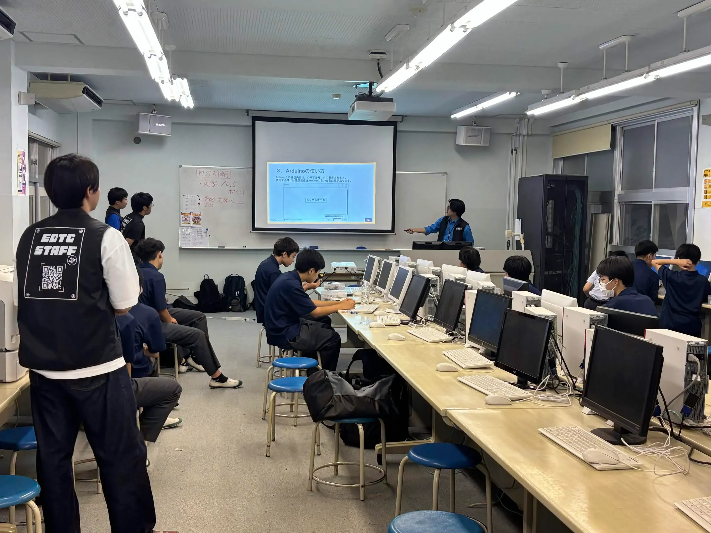
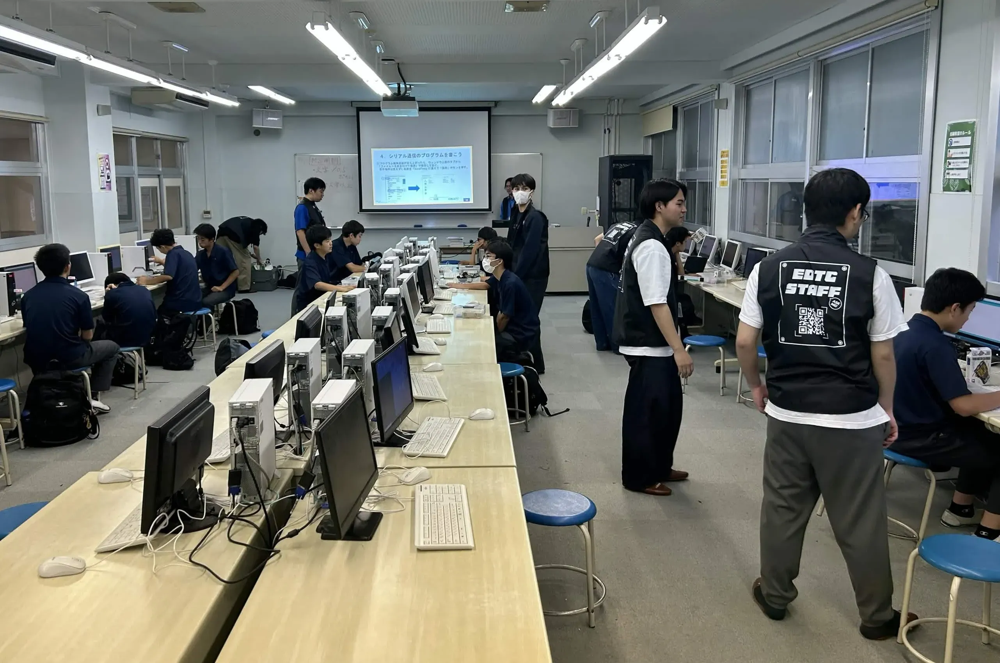
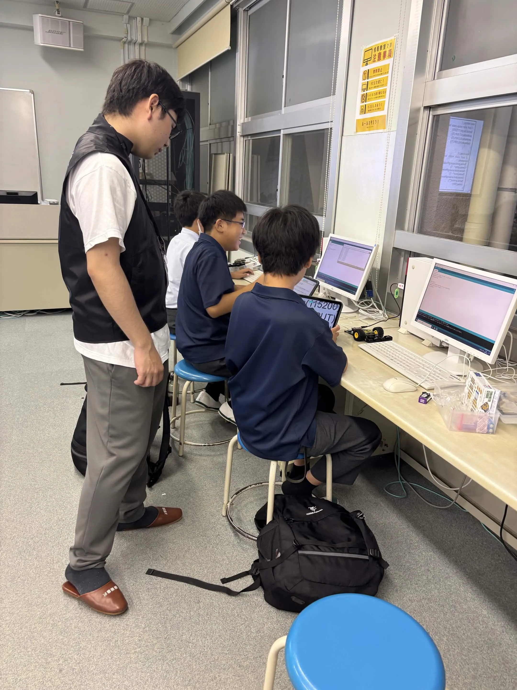

6月20日に第4回遊行塾を行わせていただきました。今回は16人の生徒に参加してもらい、ありがとうございました。

今回の授業のテーマはArduinoを使ってシリアル通信のプログラムを書こうでした。生徒さんの中にはタイピングが得意な人、苦手な人もいたけどみんなで楽しくやれました。

でもやはりArduino IDEにシリアル通信のプログラムを書く所が難しかったです。みんなでどこが違うのかどこを開くのかスタッフと一緒に作業を進めて行きました。中にはショートカットキーなど教えてる人もいて作業がスムーズに進みました。

そして最後のほうにはプログラムを完成してる人もいていざ実行すると自分が書いた言葉で出てきた時は嬉しそうにしていたりセンサーとの距離が分かるやつを実行した時は興味を持ってくれてプログラムの楽しさを知ってくれたと思います。

